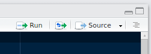

# Introduction to R

Adapted from [Tracy K. Teal's lesson](http://tracykteal.github.io/r-novice-gapminder/) and [John Moreau's workshop at the Federal Reserve Board](https://github.com/JohnRMoreau/2016-04-07-FederalReserveBoard/wiki) under a CC-By-SA license.

## Overview

The goal of this lesson is to introduce non-programmers or beginning programmers to the R programming language.
R is commonly used in many scientific disciplines for statistical analysis.
This workshop will focus on R as a general purpose programming language and data analysis tool, not on any specific statistical analysis.

### The Data

In this workshop, we will be using a subset of [the Gapminder dataset](http://www.gapminder.org/).
This is world-wide statistical data collected and curated to allow for a "fact based worldview."
These data includes things like employment rates, birth rates, death rates, percent of GDP that's from agriculture and more.
There are currently 519 variables overall, each as a time series.

You can see some examples of Gapminder's visualizations [in this TED video](http://www.ted.com/talks/hans_rosling_shows_the_best_stats_you_ve_ever_seen).
In this workshop, we'll focus just on **life expectancy at birth** and **per-capita GDP** by country, continent, and total population.

## Introduction to R and RStudio

There are two tools we're going to be using for this part of the workshop.
One is the R programming language.
**A programming language contains keywords and a prescribed grammar for linking words together** in a way that makes sense, just like a natural human language.
Programming languages differ in that **they describe a task or a series of tasks we would like a computer to execute.**

The other tool we're using is called RStudio.
**RStudio is what we would call an interactive development environment, or IDE.**
It is *interactive* because we can issue it commands in the R language and the program responds with output.
It is a *development environment* because we can use its features to develop scripts or programs in R that may consist of multiple R commands.

### RStudio Layout

**Open the RStudio program if you haven't already.**

* The interactive R console (left side of screen)
* Workspace and history (tabbed in upper right)
* Files/ Plots/ Packages/ Help (tabbed in lower right)

If we open a text file that contains an R program, what would we call an *R script,* a new pane would appear that displays the contents of that R script.
**R scripts are just plain text files but they have a \*.R file extension to indicate that the contents should be interpreted as R commands.**

### Workflow in RStudio

One way that we can use RStudio is in the interactive way I alluded to earlier.
That is, we can test R commands in the **R console** at the bottom right and maybe save those commands into an R script to run later.
This works just fine but it can be tedious and error-prone.
A better way would be for us to compose our R script in the file pane and then run the commands as a script or line-by-line.

To execute commands from the file pane in R, use the **Run** button at the top right.



## Introduction to the R Language

**As we're going to be learning about the R programming language, we'll first use it interactively.**
The pane where we enter R commands interactively is called the **R console.**
Some things to note about the R console:

* The version of R that we have installed is indicated by the version number printed on the first line. The R Foundation also gives cute names to these versions that may or may not be easier to remember.
* The R console prompts us to type in commands with a right angle-bracket. This angle bracket is called **the prompt** and it simply tells us that R is ready to receive our commands. When R is executing a command that takes a little bit of time, we might not see the prompt, like this in example, where I tell R to sleep for 5 seconds:
```r
Sys.sleep(5)
```

* The lack of a prompt means that R is busy. Notice that there is a little red stop sign at the top right of the console when R is busy. **If I want to tell R to stop what it's doing an return to waiting for my commands, I can hit the stop button. You can also hit the Esc key.** Unless my computer is so overloaded that it can't even respond, I should get my prompt back immediately after hitting this button.

### Using R as a Calculator

One of the simplest things we can use R for is arithmetic.
Try typing in these examples as I do.

```r
1 + 100
```

I hit the Enter key after typing this line to ask R to interpret my command and evaluate it.
Note that R prints the output directly below the line where I entered it and, once it is done, it displays a new prompt for my next input.
It also displays the number 1 in brackets: "[1]" right before the answer.
We'll talk about this later so, for now, just think of this as indicating the output.
**If I type an incomplete command and hit Enter, R will wait for me to complete the command on the next line.**

```r
1 +
```

The plus sign shown here isn't the plus sign in my addition problem.
Rather, anytime that you see this symbol instead of the prompt, it indicates that R is waiting for you to complete your command.
If you want to cancel this command in progress, you can hit the Esc key.

When using R as a calculator, the order of operations is just as you'd expect:

```r
3 + 5 * 2
```

However, we can use parentheses to specify the order of operations manually.
It's generally a good idea to use parentheses anytime the order of operations isn't clear from glancing at the code.

```r
(3 + 5) * 2
```

In R, very large or small numbers will often be expressed in scientific notation.

```r
2/10000
```

We can write in scientific notation as well.

```r
5e3
```

### Mathematical Functions

R has a number of built in mathematical functions.
We'll discuss how to create functions in R later.
To execute a function in R, we type its name, followed by parentheses.
**This is referred to as calling the function.**
Anything we type inside the parentheses are referred to as **arguments of the function.**

Here is the natural logarithm:

```r
log(1)
```

**Here, the number 1 is the argument of the natural log function.**
We are asking for the natural logarithm of the number 1.
The base-10 logarithm is called like this:

```r
log10(10)
```

**How can we remember all of these function names?**
We don't have to.
We can rely on R to help us by either autocompleting a function whose name we remember part of or by searching for a function's name.

For example, **if I type the following and then hit the Tab key:**

```r
?ex
```

I can see all the function names that begin with these two letters.
The function I was thinking of is the `exp()` function; the inverse of the natural logarithm.
If I use the question mark with a full function name and hit Enter, I can pull up the help documentation for that function.

```r
?exp
```

Two question marks will perform a keyword search of the available help documentation.

```r
??exponential
```

### Other Operators in R

**The mathematical symbols we just saw are referred to as operators in R.**
There are other operators we can use to compare things, as in the following examples.

```r
1 == 1
```

Here, `TRUE` in all capital letters is a special value that indicates something is true.
The double-equal sign is one of a group of **comparison operators**; this one tests to see whether or not two values, one of the left side and the other on the right side, are equal to each other.
Here's another example that is `TRUE`.

```r
1 != 2
```

This operator is the opposite of the comparison operator we just saw; this one determines whether or not the two values are *not* alike.
The exclamation mark, in general, can be read as "not."
It has a meaning that is the opposite of what it is attached to.
For instance:

```r
!TRUE
```

**As we can see, "not true" is indeed false.**
`FALSE`, in all capital letters, is a special value that is the opposite of the special value `TRUE`.
Here are some examples of comparison operators.

```r
1 < 2
```

"One less than two" is just what we'd expect.
Same for less-than-or-equal, greater-than, and greater-than-or-equal.

```r
1 <= 1
1 > 0
1 >= -3
```

### Variables and Assignment

When we want R to remember a value or store the result of a calculation, we can give that value or result a name.
**The name itself is called a variable, because the name could be given to any other value. We assign values to variables using the assignment operator.**

```r
x <- 1/2
```

You can think of the assignment operator as an arrow from the value to the variable; it "points" where to put the value.
Note that when we use assignment to store a variable, the result isn't printed to the screen.
We can request R to read the result back to us when we ask R for the value of the named variable.

```r
x
```

It's important to put proper spacing around the assignment operator.
Otherwise, it can be confusing whether you intended to type:

```r
x<-4
x < -4 # less than -4?
x <- 4 # or store the value -4?
```

If we look in the **Environment** tab, we can see the value of our variable `x` at any time.
We can now use `x` in place of its value in any calculation that expects a number.

```r
log(x)
```

**We can re-assign variables to new values.**

```r
x <- 100
x
```

We can also use the value of a variable to update that same variable.
**More generally, the right side of an assignment expression can be any valid R expression.**

```r
x <- (x + 1)
x
```

#### Variable Names

There are some restrictions on the names we can use for variables.
**Variable names can contain only letters, numbers, underscores, and periods.**
Here are some examples:

* `periods.between.words`
* `underscores_between_words`
* `camelCaseVariableNames`

Whatever you choose is up to you but be consistent.

<!--TODO for advanced: Suggestions of idiomatic R variable names-->

<!--TODO for advanced version of lesson: Discuss alternative equal sign as assignment operator and edge cases:
log(x=5)
x
log(x <- 5)
x
-->

It's also possible to use the equal sign for assignment.

```r
x = 1/2
```

However, this is much less common among R users.
The most important thing is to be consistent in your use of one assignment operator than the other.
There are places in R where it is less confusing to use the arrow form than than the equal sign, so the recommendation is to use the arrow form.

We can determine what variables are in our environment by using the `ls()` function.
Note that the `ls()` function takes no arguments but we still use the closed parentheses to call the function.

```r
ls()
```

**What happens if we try to call `ls` but we forget the parentheses?**

```r
ls
```

We can use the `rm()` function to delete things in our environment; this helps us "tidy up."

```r
rm(x)
```

If we want to delete everything in our environment, we can type:

```r
rm(list = ls())
```

**Why does this remove everything in our environment?**
Hint: type `?rm` to see the help documentation on `rm()`.

Here, `list` is a **keyword argument.**
With the equal sign, we've indicated that the results of the `ls()` function should be used as the argument `list` in calling the function `rm()`.
**When assigning values to arguments, you must use the `=` operator, not the arrow form.**

Here's what NOT to do:

```r
rm(list <- ls())
```

We should pay attention when we see an error message in R.
Usually, it contains information on how to fix a problem.

## Loading Packages in R

Let's look at the help documentation for the `log()` function again.

```r
?log
```

**In the curly braces by the function's name, at the top of the documentation, is the name of the package that contains this function.**
We can see that `log()` is part of the `base` package, which is a built-in package of basic functions in R.
**We can see what other packages are already installed with the following function.**

```r
installed.packages()
```

This output is really long and detailed.
Luckily, in RStudio we have a "Packages" tab that has a list of our installed packages that is easier to read.
While a package may be installed, its contents are not available for our use until it is loaded into the **namespace**, or our current environment.
These packages are missing a checkmark in the left-most column.
If you check one of these packages, RStudio will load that package into the environment.
We can see that this is done with the `library()` command.

```r
library(parallel)
```

If we want to learn more about what this new package does we can use the question mark (or `help()` function) with the package's name.

```r
?parallel
```

We can install new packages using the `install.packages()` function.
**Try installing the `reshape2` package on your computer.**

```r
install.packages('reshape2')
```

-------------------------------------------------------------------------------

## Checkpoint: Basic R

**Now you should be familiar with the following:**

* The user interface of the RStudio IDE;
* Variables in R and their assignment;
* Managing your workspace in an interactive R session;
* Use of mathematical and comparison operators in R;
* Calling functions in R.

-------------------------------------------------------------------------------

## Project Management with RStudio

The scientific process is naturally incremental and many projects start life as random notes, some code, then a manuscript, and, eventually, everything is a bit mixed together.
**What's wrong with organizing a project like this?**

[Link to "bad layout" figure](http://swcarpentry.github.io/r-novice-gapminder/fig/bad_layout.png)

* It is really hard to tell which version of your data is the original and which is modified.
* We may have multiple versions of our results and, here, the results are mixed together making it difficult to tell them apart at a glance.
* It is difficult to relate the correct outputs, for example, a certain graph, to the exact code that has been used to generate it.

**A good project layout, on the other hand, can make your life easier in so many ways:**

* It will help ensure the integrity of your data.
* It makes it simpler to share your code with someone else.
* It allows you to easily upload your code when submitting a manuscript for publication.
* It makes it easier to pick the project back up after a break.

### How RStudio Helps

RStudio has project management built- in.
We'll use this today to create a self-contained, reproducible project.

**Challenge: Create a self-contained project in RStudio.**

1. Click the "File" menu button, then "New Project".
2. Click "New Directory".
3. Click "Empty Project".
4. Type in the name of the directory to store your 5. project, e.g. "my_project".
6. Make sure that the checkbox for "Create a git repository" is selected.
7. Click the "Create Project" button.

Now, when we start R in this project directory or when we open this project in RStudio, all of our work on this project will be entirely self-contained in this directory.

### Best Practices

There is no single right way to organize a project but there are important best practices to follow.

* **Treat data as read only:** This is probably the most important goal of setting up a project. Data is typically time consuming and/or expensive to collect. Working with the data interactively (e.g., in Microsoft Excel) where they can be modified means you are never sure of where the data came from or how it has been modified since collection. **In science, we call this the problem of scientific provenance; keeping track of where our data came from and what we did to it in order to get some important result.**
* **Data cleaning:** In many cases, your initial data will be "dirty." That is, it needs significant pre-processing in order to coerce it into a format that R will find useful. This task is sometimes called "data munging." I find it useful to store these scripts in a separate folder and to create a second read-only data folder to hold the "cleaned" data sets.
* **Treat generated output as disposable:** You should be able to regenerate all of your results from your R scripts. There are many ways to do this. I find it useful to have output folders with dates for names in `YYYYMMDD` format so that I can connect outputs to new developments in my research.

### Challenge: Saving the Data to a New Directory

Using RStudio's project management pane at the lower-right, create a new folder called `data` inside your project folder.
**Then, copy the `gapminder-FiveYearData.csv` file to the new `data` directory.**

<!--TODO Advanced lesson: version control.

"We also set up our project to integrate with Git, putting it under version control..."-->

## Getting Help

The R environment and every published package provide help files for functions.
Recall that, in order to search for help on a specific function from a package that is currently loaded into the **namespace** (the interactive R session), we can use a question mark before its name.
We can also call the `help()` function on the function's name.

```r
?floor
help(floor)
```

**There's a lot that goes into function documentation but there are a few things in particular to pay attention to:**

* **Description:** This describes the purpose of the thing you asked help about.
* **Usage:** This provides examples of how the function is called.
* **Arguments:** This is a list of optional and required arguments and the type of values they expect.

```r
?log
```

Here are some other sections we can see in the `log()` documentation:

* **Value:** This describes what data the function returns.
* **See also:** This is a list of related functions.
* **Examples:** Shows examples for how the function might be used.

**How can we get help on operators?**

```r
?"+"
```

### Seeking Help in the Community

One of the things that surprises new software developers the most is how frequently more experienced software developers use search engines to figure out a problem they have.
"Just Google it" may sound like a trivial response to a hard problem.
However, most of the time, any problem you're having in R or with another software tool is a problem someone else has encountered before.
This is why there are entire communities devoted to software questions online, [like Stack Overflow](http://stackoverflow.com/).

We can restrict our questions on Stack Overflow to questions about R by adding the `[r]` keyword to our queries.
If you can find the answer and need to post a new question, there are a couple of functions in R that can help you.

```r
?dput
```

`dput()` will dump the data you're working with into a format so that it can be copy-and-pasted by anyone else into their R session.

```r
sessionInfo()
```

`sessionInfo()` prints out a description of your platform, the operating system, your current version of R and the versions of the packages you have installed and loaded.
This is important information to include in a post.

### Challenge: Learning to Create Vectors

**Look at the help for the `c` function. What kind of vector do you expect you will create if you evaluate the following?**

```
c(1, 2, 3)
c('d', 'e', 'f')
c(1, 2, 'f')
```

## Data Structures

One of R's most powerful features is its ability to deal with tabular data--or data in a table form.
This is also the most common format for data storage and presentation, spreadsheets being the most prominent example.
Let's start by making a toy dataset in your `data/` directory.

```
coat,weight,likes_string
calico,2.1,1
black,5.0,0
tabby,3.2,1
```

*(Learners may need to put an empty line at the of the file for R to read it without error.)*

Call the new text file `feline-data.csv`.
**We can create this new text file directly in RStudio by going to File -> New File -> Text File.**

We can read this CSV file into R using the `read.csv()` function.

```{r}
cats <- read.csv(file = "data/feline-data.csv")
cats
```

Typing the name of the variable we stored the data in, we get a nicely spaced, tabular representation of our data.
The `read.csv()` function is used for reading in tabular data stored in a text file where the columns of data are delimited by commas (where CSV stands for "comma-separated values").
Tabs are also commonly used to separated columns; if your data are in this format you can use the function `read.delim()`.
If the columns in your data are delimited by a character other than commas or tabs, you can use the more general and flexible `read.table()` function.

We can access the values in a particular column of our dataset using the `$` operator.

```r
cats$weight
cats$coat
```

**We can perform operations on such a list of values the same as if it was a single value.**
For instance, what if we discovered that the scale used to weight these cats systematically underestimated their weight by 1 kilogram?

```r
cats$weight + 1
```

Try this example:

```r
paste("My cat is", cats$coat)
```

What about:

```r
cats$weight + cats$coat
```

**What went wrong?**

### Data Types in R

We can ask what type of data something is in R using the `typeof()` function.

```r
typeof(cats$weight)
```

**There are 5 main data types: `double`, `integer`, `complex`, `logical` and `character`.**
`double` is for floating-point or decimal data whereas `integer` is for whole numbers only.
Sometimes, you might see an `L` suffixed to an integer in R; this is to explicitly indicate that the number is an integer.

```r
typeof(1)
typeof(1L)
```

No matter how complicated our analyses in R become, all of our data can be described by one of these 5 data types.
This has important consequences.
Let's make a new dataset based on our original.
**You should still have `feline-data.csv` opened as a text file at the top-left of RStudio. If not, you can open it again from the file plane at the bottom-right.**
Add this line to the bottom of the file and save it as a new file, `feline-data2.csv` in the `data/` directory.

```
tabby,2.3 or 2.4,1
```

Now, we'll read in this new CSV file and give it a new variable name.

```r
cats2 <- read.csv(file = "data/feline-data2.csv")
```

Now what happens when we try to correct the weights in the `weight` column as we did before?

```r
cats2$weight + 1
```

When R reads a CSV into one of these tables, it insists that everything in a column be the same basic type; if it can’t understand everything in the column as a `double`, then nobody in the column gets to be a `double`.
**The table that R loaded our cats data into is something called a `data.frame`, and it is our first example of something called a data structure--that is, a structure which R knows how to build out of the basic data types.**
We can confirm that this is a `data.frame` by calling the `class()` function on it.

```r
class(cats)
```

### Vectors and Type Coercion

**A data frame in R is a data structure that is composed of another data structure: the vector.**

```r
my.vector <- vector(length = 3)
my.vector
```

A vector in R is essentially an ordered list of things, with the special condition that everything in the vector must be the same basic data type.
If you don’t choose the data type, the default is the `logical` data type; or, you can declare an empty vector of whatever type you like.

```r
my.vector <- vector(mode='character', length=3)
my.vector
```

A vector is like a row or column in a table.
Data frames use vectors to represent the contents of a column.
**We've seen vectors before, when we learned about the concatenate or `c()` function. This function allows us to create vectors with explicit contents.**

```r
x <- c(2, 3, 5, 8)
x
```

The concatenate function can also append values to the end of an existing vector.

```r
y <- c(x, 15)
y
```

We also use a shortcut to create a series of numbers.

```r
z <- 1:10
z
```

The `seq` function, more generally, allows us to create an arbitrary sequence of integers or doubles as a vector.

```r
seq(10)
seq(1, 10, by=0.2)
```

**What happens when we construct the following vector?**

```r
c(2, "3", 5)
```

**This is something called type coercion and it is the source of many surprises and the reason why we need to be aware of the basic data types and how R will interpret them.**
When R encounters a mix of types (here `numeric` and `character`) to be combined into a single vector, it will force them all to be the same type.
What type they are forced to be depends on what is easiest or safest.
In the previous example, it is easier to consider all of the contents as `character` strings because, after all, we typed in the characters from a keyboard.
The bottom-line is: **If your data don't look like what you thought it was going to look like, type coercion may well be to blame.**

Type coercion can also be useful.
For example, in the `cats` dataset, we have a column `like_string` that represents whether or not that cat like string.
Thus, it should have a `logical` value but, as we recall, we used 1s and 0s to represent the data in our CSV file.

```r
cats$likes_string
```

We should convert this `integer` data type to a `logical` data type in R.
We can coerce the data type of this column to `logical` using the `as.logical()` function and assigning its result to that column.

```r
cats$likes_string <- as.logical(cats$likes_string)
cats$likes_string
```

### Working with Vectors

There are some helper functions that we can use with vectors, particularly as they get very large.

```r
x <- seq(1, 10, by=0.1)
head(x, n=3)
```

The `head()` function shows us the first `n` entries of a vector.
**Here, I specified that I wanted to see the first 3 entries. Can anyone tell me how many entries `head()` shows by default?**

```r
tail(x)
length(x)
```

**We can also assign names to the entries in our vector.**

```r
example <- 5:8
names(example) <- c("a", "b", "c", "d")
example
```

### Challenge: Naming the Alphabet

Start by making a vector with the numbers 1 through 26.
Multiply the vector by 2, and give the resulting vector names A through Z (hint: there is a built in vector called `LETTERS`).

### Factors

Recall that the columns of a data frame are vectors.
We can confirm this using the `str()` function, which gives us information on the structure of a vector.

```r
str(cats$weight)
str(cats$likes_string)
```

What about this example?

```r
str(cats$coat)
```

This is an example of what in R are called factors.
**Factors look like `character` data but are typically used to represent discrete categories of data.**
For example, let's make a vector of cat colorations.

```r
colors <- c('tabby', 'black', 'tabby', 'sable', 'calico', 'sable')
colors
str(colors)
```

Currently, our vector is a character vector.
We can convert our vector to a factor using the `factor()` function.

```r
categories <- factor(colors)
categories
str(categories)
```

**Is there a factor already in our `cats` data? Which column is it?**

### Challenge: Keeping Strings as Strings

In the `read.csv()` function, how can we prevent R from coercing our character strings to factors?
Re-load the `cats` data with `read.csv()` so that the `coats` column is a character string, not a factor.

### Factors and Reference Levels

By default, R orders the levels of factor column alphabetically.
Instead, we can manually specify the levels when we create a factor column.

```r
my.data <- c("case", "control", "control", "case")
example <- factor(my.data, levels = c("control", "case"))
str(example)
```

Here, we've explicitly told R that `control` should be ordered before `case`.
This is a crucial choice in the specification and interpretation of linear models, for example, where we need the reference level of a categorical variable to be a certain level, not necessarily the first one in alphabetical order.

### Lists

Another data structure commonly used in R is the `list`.
Unlike vectors, you can put different data types together in a list.

```r
list(1, 'a', TRUE, 1+4i)
```

We can also created **named lists** by assigning names to each entry.

```r
list(title = "Research Bazaar", numbers = 1:10, data = TRUE)
```

We can now understand the somewhat surprising result of asking for the "type" of a data frame.

```r
typeof(cats)
```

**We see that `data.frames` look like lists "under the hood." This is because a `data.frame` is really a `list` of vectors and factors.**
A `data.frame` is a special case of a `list` where the vectors must have the same length.

### Indexing Data Frames

We saw how we can access the column of a data frame using the `$` symbol.

```r
cats$weight
```

We can also access a column by its index--the ordinal that specifies its position from left to right.

```r
cats
cats[,1]
```

Data frames have two parts: rows and columns.
Here, the comma indicates we are indexing the *second part* of the data frame (columns), not the first part (rows).
We can access the first row as follows.

```r
cats[1,]
```

**How can we access the `weight` column of our `cats` data frame?**

```r
cats[,2]
```

**How can we access the value in the first row and the first column of our data frame?**

```r
cats[1,1]
```

### Matrices

The last data structure we'll talk about today is the matrix.

```r
mat <- matrix(0, ncol=4, nrow=3)
mat
class(mat)
typeof(mat) # A matrix can hold only one type of data
dim(mat)
nrow(mat)
ncol(mat)
```

**Predict the result of calling `length()` on our matrix.**

We can see how the indexing notation from data frames works with matrices, too.

```r
mat <- matrix(LETTERS, ncol=13, nrow=2)
mat
mat[2,4]
```

<!--TODO: Compare to subsetting tutorial:
    http://tracykteal.github.io/r-novice-gapminder/06-data-subsetting.html -->

### Challenge: Matrices

Make another `matrix`, this time containing the numbers `1:50`, with 5 columns and 10 rows.
Did the `matrix()` function fill your matrix by column, or by row, as its default behaviour?
See if you can figure out how to change this (hint: read the documentation for `matrix()`).

-------------------------------------------------------------------------------

## Checkpoint: Data Structures in R

**Now you should be familiar with the following:**

* The different types of data in R.
* The different **data structures** that we can use to organize our data in R.
* How to ask basic questions about the structure and size of our data in R.

-------------------------------------------------------------------------------

## Conclusion and Summary

### Other Resources

* [Quick-R](http://www.statmethods.net/): "An easily accessible reference...for both current R users, and experienced users of other statistical packages...who would like to transition to R."
* [RStudio Cheat Sheets](https://www.rstudio.com/resources/cheatsheets/): A list of informational graphics that help remind you how to use some advanced features in RStudio.
* [R Cookbook](http://www.cookbook-r.com/): Code samples for a number of "common tasks and problems in analyzing data."
