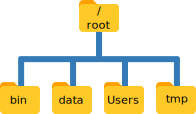
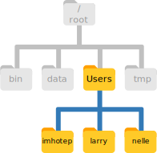

# The Unix Shell

## Background

At a high level, computers do four things:

- Run programs,
- Store data,
- Communicate with each other, and
- Interact with us.

They can do the last of these in many different ways, including direct brain-computer interfaces and speech recognition, using systems such as Alexa or Google Home.
While such hardware interfaces are becoming more commonplace, most interaction is still done using screens, mice, touchpads and keyboards.
Although most modern desktop operating systems communicate with their human users by means of windows, icons and pointers, these software technologies didn’t become widespread until the 1980s.
Before this time, most people used *line printers.*
These devices only allowed input and output of the letters, numbers, and punctuation found on a standard keyboard, so programming languages and software interfaces had to be designed around that constraint.

**Let's introduce two terms that may be new to you.**

- The kind of interface that developed from keyboard inputs is called a *command-line interface,* or CLI.
- This distinguishes the CLI from a *graphical user interface,* or GUI, which most people now use.

The heart of a CLI is a *read-evaluate-print loop,* or REPL: when the user types a command and then presses the Enter (or Return) key, the computer reads it, executes it, and prints its output.
The user then types another command, and so on until the user logs off.

### The Shell

This description makes it sound as though the user sends commands directly to the computer, and the computer sends output directly to the user.
**In fact, there is usually a program in between called a command shell.**
What the user types goes into the shell, which then figures out what commands to run and orders the computer to execute them.
(Note that the shell is called "the shell" because it encloses the operating system in order to hide some of its complexity and make it simpler to interact with.)

A shell is a program like any other.
What's special about it is that its job is to run other programs rather than to do calculations itself.
The most popular Unix shell is Bash, the Bourne Again SHell (so-called because it’s derived from a shell written by Stephen Bourne).
Bash is the default shell on most modern implementations of Unix and in most packages that provide Unix-like tools for Windows.

**At first, the advantages of using the shell over the GUI may not be obvious.**
However, by the end of this lesson, I hope to make a compelling case for how the Shell allows us to get more work done faster and more reliably than by pointing and clicking.

## Navigating Files and Directories

**Before we can use the shell for what it's really powerful at--automating tasks and improving our productivity--we need to become comfortable with navigating and manipulating our file system in the shell.**

- The *file system* is the part of our operating system responsible for managing files and directories.
- Many of you may currently use a point-and-click file browser like Windows Explorer or Finder (on Mac).
- We'll see how the shell allows us to a lot of the same things (moving files, renaming files, creating folders).

**Let's open up the shell and get started.**

```sh
$ whoami
```

This command's output is the identifier for the current user, i.e., your username.
More specifically, when we type `whoami` at the shell:

1. The shell finds a program called `whoami` and runs it.
2. The shell displays the output from that program.
3. Then, the shell displays a new prompt so that we know it is ready for more input.

**The shell is a program that runs other programs, so the commands we type must be the names of existing programs.**

```sh
$ something
```

```sh
$ pwd
```

The command `pwd` stands for "print working directory" and tells us where we our on our file system.
If we think of a file browser, the *current working directory* is whatever directory we have open, typically in the right-hand pane.

**Since we just started the shell, by default, our current working directory is our home directory.**
To understand what a "home directory" is, let’s have a look at how the file system as a whole is organized.
Here is an example file system similar to the file system on Mac OSX; it may look pretty different from yours.



- At the top is the *root directory;* the directory that holds everything else. We refer to it using a forward-slash character on its own; this is the leading slash we see when we type `pwd`.
- Inside that directory are several others. The `Users` directory is where user's personal files are stored.
- **Notice that there are two meanings of the forward slash:** When it appears at the front of a file or directory name, it refers to the root directory. When it appears *inside* a file path, it's just a separator between directory names.

Underneath `/Users`, we find one directory for each user with an account on this hypothetical machine.



Next, we'll see how to list the contents of our file system.

### Listing Files and Folders in a Directory

```sh
$ ls
```

The `ls` command stands for "listing;" it's a program that displays the contents of a directory.
By default, it prints the names of the files in the current directory in alphabetical order, arranged neatly into columns.

**Programs in the shell often take special options, also called flags, that change the output of the command.**
The `ls` command accepts a `-F` flag that highlights the names of directories, making it easier to distinguish them from files.

```sh
$ ls -F
```

We can find out what other options the `ls` command accepts by typing:

```sh
$ ls --help
```

**Note that most of these options can be specified one of two ways: with a single dash or a double-dash.**
The single dash precedes a single letter; it's basically a shortcut for the double-dash format.
For example, whether we type `-F` or `--classify` after `ls`, we get the same result.

```sh
$ ls -F
$ ls --classify
```

In addition to *options,* many commands we can use in the shell accept one or more *arguments.*
An argument to a command is some input, required or not, that the command will act on.
The `ls` command accepts as an argument the path to another directory.

```sh
$ ls -F Desktop
```

**Your output from this command should be a list of the files on your desktop and should include the folder data-shell. Take a moment to confirm that is the case.**

### Changing the Current Working Directory

**As we've seen, the bash shell is strongly dependent on the idea that our files are organized in a hierarchical file system.**
Organizing this this way, in a tree structure, allows us to keep track of our work.
While it's possible to put hundreds of files in our home directory, just as it's possible to pile hundreds of papers on our desk, it's not the best strategy if we ever hope to find something in particular.

Let's take a look at the contents of the `data-shell` folder.

```sh
$ ls -F Desktop/data-shell
```

**Note that we've provided the path to a directory that is contained inside another directory inside our current directory.**
We can provide arbitrarily long file paths to arbitrarily deep files and folders on our system, as long as they are accurate.

If we want to work with files and folders inside `data-shell`, however, and we don't want to type `Desktop/data-shell` every time, it would be better if **we changed our current working directory to `data-shell`, which is precisely what the `cd` command does.**

```sh
cd Desktop
cd data-shell
cd data
```

The `cd` command stands for "change directory."
Now where are we?
How can we find out?

```sh
pwd
ls -F
```

We now know how to go down the directory tree, but how do we go up?

```sh
cd data-shell
```

**With what we've seen so far, we can only use `cd` to see directories below our current working directory.**
We'll introduce a special symbol that indicates the directory above our current working directory.

```sh
cd ..
pwd
```

The `..` symbol is a special directory name meaning "the directory containing the current working directory."
We also call this the *parent* of the current working directory.
This special always-parent directory doesn't show up in `ls` by default, but...

```sh
ls -F -a
```

The `-a` option stands for "show all" and it can be used to see hidden files and folders.

### Challenge: Hidden Files and Directories

We've seen that the `..` symbol means the "parent of the current working directory," or, "the directory above this one."
Notice that in the listing from the last command there is also a `.` symbol in the list.
What does the `.` symbol stand for?
**Hint:** Think of a command you've seen that this symbol could be an argument for.
