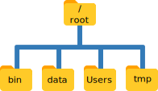
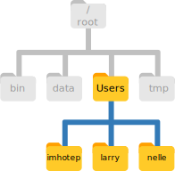
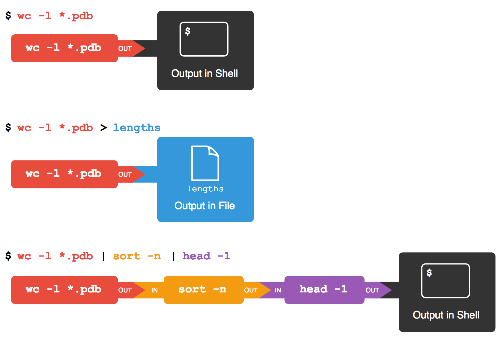

# The Unix Shell

## Background

At a high level, computers do four things:

- Run programs,
- Store data,
- Communicate with each other, and
- Interact with us.

They can do the last of these in many different ways, including direct brain-computer interfaces and speech recognition, using systems such as Alexa or Google Home.
While such hardware interfaces are becoming more commonplace, most interaction is still done using screens, mice, touchpads and keyboards.
Although most modern desktop operating systems communicate with their human users by means of windows, icons and pointers, these software technologies didn’t become widespread until the 1980s.
Before this time, most people used *line printers.*
These devices only allowed input and output of the letters, numbers, and punctuation found on a standard keyboard, so programming languages and software interfaces had to be designed around that constraint.

**Let's introduce two terms that may be new to you.**

- The kind of interface that developed from keyboard inputs is called a *command-line interface,* or CLI.
- This distinguishes the CLI from a *graphical user interface,* or GUI, which most people now use.

The heart of a CLI is a *read-evaluate-print loop,* or REPL: when the user types a command and then presses the Enter (or Return) key, the computer reads it, executes it, and prints its output.
The user then types another command, and so on until the user logs off.

### The Shell

This description makes it sound as though the user sends commands directly to the computer, and the computer sends output directly to the user.
**In fact, there is usually a program in between called a command shell.**
What the user types goes into the shell, which then figures out what commands to run and orders the computer to execute them.
(Note that the shell is called "the shell" because it encloses the operating system in order to hide some of its complexity and make it simpler to interact with.)

A shell is a program like any other.
What's special about it is that its job is to run other programs rather than to do calculations itself.
The most popular Unix shell is Bash, the Bourne Again SHell (so-called because it’s derived from a shell written by Stephen Bourne).
Bash is the default shell on most modern implementations of Unix and in most packages that provide Unix-like tools for Windows.

**At first, the advantages of using the shell over the GUI may not be obvious.**
However, by the end of this lesson, I hope to make a compelling case for how the Shell allows us to get more work done faster and more reliably than by pointing and clicking.

## Navigating Files and Directories

**Before we can use the shell for what it's really powerful at--automating tasks and improving our productivity--we need to become comfortable with navigating and manipulating our file system in the shell.**

- The *file system* is the part of our operating system responsible for managing files and directories.
- Many of you may currently use a point-and-click file browser like Windows Explorer or Finder (on Mac).
- We'll see how the shell allows us to a lot of the same things (moving files, renaming files, creating folders).

**Let's open up the shell and get started.**

```sh
$ whoami
```

This command's output is the identifier for the current user, i.e., your username.
More specifically, when we type `whoami` at the shell:

1. The shell finds a program called `whoami` and runs it.
2. The shell displays the output from that program.
3. Then, the shell displays a new prompt so that we know it is ready for more input.

**The shell is a program that runs other programs, so the commands we type must be the names of existing programs.**

```sh
$ something
```

```sh
$ pwd
```

The command `pwd` stands for "print working directory" and tells us where we our on our file system.
If we think of a file browser, the *current working directory* is whatever directory we have open, typically in the right-hand pane.

**Since we just started the shell, by default, our current working directory is our home directory.**
To understand what a "home directory" is, let’s have a look at how the file system as a whole is organized.
Here is an example file system similar to the file system on Mac OSX; it may look pretty different from yours.



- At the top is the *root directory;* the directory that holds everything else. We refer to it using a forward-slash character on its own; this is the leading slash we see when we type `pwd`.
- Inside that directory are several others. The `Users` directory is where user's personal files are stored.
- **Notice that there are two meanings of the forward slash:** When it appears at the front of a file or directory name, it refers to the root directory. When it appears *inside* a file path, it's just a separator between directory names.

Underneath `/Users`, we find one directory for each user with an account on this hypothetical machine.



Next, we'll see how to list the contents of our file system.

### Listing Files and Folders in a Directory

```sh
$ ls
```

The `ls` command stands for "listing;" it's a program that displays the contents of a directory.
By default, it prints the names of the files in the current directory in alphabetical order, arranged neatly into columns.

**Programs in the shell often take special options, also called flags, that change the output of the command.**
The `ls` command accepts a `-F` flag that highlights the names of directories, making it easier to distinguish them from files.

```sh
$ ls -F
```

We can find out what other options the `ls` command accepts by typing:

```sh
$ ls --help
```

**Note that most of these options can be specified one of two ways: with a single dash or a double-dash.**
The single dash precedes a single letter; it's basically a shortcut for the double-dash format.
For example, whether we type `-F` or `--classify` after `ls`, we get the same result.

```sh
$ ls -F
$ ls --classify
```

In addition to *options,* many commands we can use in the shell accept one or more *arguments.*
An argument to a command is some input, required or not, that the command will act on.
The `ls` command accepts as an argument the path to another directory.

```sh
$ ls -F Desktop
```

**Your output from this command should be a list of the files on your desktop and should include the folder data-shell. Take a moment to confirm that is the case.**

### Changing the Current Working Directory

**As we've seen, the bash shell is strongly dependent on the idea that our files are organized in a hierarchical file system.**
Organizing this this way, in a tree structure, allows us to keep track of our work.
While it's possible to put hundreds of files in our home directory, just as it's possible to pile hundreds of papers on our desk, it's not the best strategy if we ever hope to find something in particular.

Let's take a look at the contents of the `data-shell` folder.

```sh
$ ls -F Desktop/data-shell
```

**Note that we've provided the path to a directory that is contained inside another directory inside our current directory.**
We can provide arbitrarily long file paths to arbitrarily deep files and folders on our system, as long as they are accurate.

If we want to work with files and folders inside `data-shell`, however, and we don't want to type `Desktop/data-shell` every time, it would be better if **we changed our current working directory to `data-shell`, which is precisely what the `cd` command does.**

```sh
cd Desktop
cd data-shell
cd data
```

The `cd` command stands for "change directory."
Now where are we?
How can we find out?

```sh
pwd
ls -F
```

We now know how to go down the directory tree, but how do we go up?

```sh
cd data-shell
```

**With what we've seen so far, we can only use `cd` to see directories below our current working directory.**
We'll introduce a special symbol that indicates the directory above our current working directory.

```sh
cd ..
pwd
```

The `..` symbol is a special directory name meaning "the directory containing the current working directory."
We also call this the *parent* of the current working directory.
This special always-parent directory doesn't show up in `ls` by default, but...

```sh
ls -F -a
```

The `-a` option stands for "show all" and it can be used to see hidden files and folders.

### Challenge: Hidden Files and Directories

We've seen that the `..` symbol means the "parent of the current working directory," or, "the directory above this one."
Notice that in the listing from the last command there is also a `.` symbol in the list.
What does the `.` symbol stand for?
**Hint:** Think of a command you've seen that this symbol could be an argument for.

### Relative versus Absolute File Paths

**So far, we've seen three commands for navigating our file system. What do they mean?**

- `pwd`
- `ls`
- `cd`

Let's explore these commands further.
What happens if you type `cd` on its own, without specifying a directory?

```sh
$ cd
```

How can you check what happened?

Let's go back to the `data` directory we were in before.
Last time, we used three commands to ge there.
Let's string those three file paths together so that we only have to type `cd` once.

```sh
$ cd Desktop/data-shell/data
```

**So far, when specifying directory names, we've been using relative paths.**
A relative path is a file path that is relative to the current working directory.
That is, when we use a relative path with a command like `ls` or `cd`, the program tries to find that location based on our current location in the file system.

It's also possible to specify an *absolute path* to a directory by specifying its entire path from the root directory, which is indicated by the leading slash.
Note that absolute paths are what is printed out by the `pwd` program.

```sh
$ pwd
$ cd /home/arthur/Desktop/data-shell
$ cd ~/Desktop/data-shell
```

## Working with Files and Directories

We now know how to explore files and directories on our file system but how do we create them in the first place?

```sh
$ ls -F
```

Let's create a new directory called `thesis` using the command:

```sh
$ mkdir thesis
```

As you might have guessed, `mkdir` stands for "make directory."
Since `thesis` is a relative path, the new directory is created in the current working directory.

```sh
$ ls -F
```

**Here are some tips for naming files and folders:**

- Don't use names with spaces; as we've seen, whitespace is used to separate arguments on the command line, which means that if a file or folder has a space in it, the shell doesn't know if we have given it one name or two.
- Don't begin a name with a dash; as we've seen, dashes indicate options or flags on the command line.
- Stick with letters, numbers, the dot, and the underscore.

If you need to work with a file that someone else named and it has a space character in it, you should surround the name of the file in double quotes.

**Now, since we've just created the `thesis` directory, there is nothing inside it.**

```sh
$ ls -F thesis
```

Let's change our working directory to `thesis` and then start our text editor.

```sh
$ cd thesis
$ nano draft.txt
```

Let's type in a few lines of text; whatever you want.

```
It's not "publish or perish" anymore,
it's "share and thrive."
```

Once we're happy with the contents of our file, we type `Ctrl + O` to save the file, then `Ctrl + X` to exit `nano`.

```sh
$ ls
$ cat draft.txt
```

### Removing Files and Directories

Let's say we've decided our current draft is utter trash.

```sh
$ rm draft.txt
```

**Remember that when you use `rm`, the file is gone forever. There is no "Recycle Bin" or "Trash Bin" that you can retrieve the file from when you use this command.**

Let's create a new, empty draft of our thesis to work on later.
The `touch` command is useful for creating empty files or updating the "last modified" attribute of a file.

```sh
$ touch draft.txt
```

But, we changed our mind again and decided to get rid of the entire `thesis` directory.

```sh
$ cd ..
$ rm thesis
```

We get an error when we try to `rm` the `thesis` directory because `rm`, by default, works only on files, not directories.
**Type this next command very carefully!**

```sh
$ rm -r thesis
```

**One must exercise caution when using the `-r` flag with `rm`.**
The `-r` flag stands for "recursive," meaning that the shell will delete the specified directory and everything inside it along with everything inside the subdirectories of that directory, and so on.

### Renaming, Moving, and Copying Files

Let's recreate the `thesis` directory one final time.

```sh
$ mkdir thesis
$ touch thesis/draft.txt
$ ls thesis
```

Say we decide to change the name of `draft.txt`, since it isn't very informative.
We can use the `mv` command, which stands for "move" to rename a file:

```sh
$ mv thesis/draft.txt thesis/20170726_draft.txt
```

The `YYYYMMDD` date format at the beginning of the filename ensures that, when the shell sorts filenames alphabetically, the drafts will also be in chronological order.

How does `mv` work?

- The first argument to `mv` tells the program what file we want to move;
- The second argument tells the program where the file should be moved to.
- If the second argument is a file path that doesn't exist, then `mv` essentially renames the file by putting the file we want to move onto the new file path.

```sh
$ ls thesis
```

**Again, we need to be careful when using the `mv` command.**
If the second argument is a file path that already exists--that is, a file with the new name already exists--then that second file will be overwritten by the first!

The `mv` command can also be used to move a file without changing its name.
For instance, let's move our new thesis draft into the current working directory.
This time, the second argument to `mv` is the name of a directory.
When `mv` sees an existing directory as the second argument, it understands that we want to take the file and put it into this directory.

```sh
$ mv thesis/20170726_draft.txt .
$ ls thesis
$ ls .
```

(Remember that the dot stands for the current working directory.)

What if we want to copy a file?
The `cp` command stands for "copy."
Let's use it to create a backup of our thesis.

```sh
$ mkdir backup
$ cp 20170726_draft.txt backup/
$ ls backup
```

### Challenge: Renaming Files

Suppose that you created a text file in your current directory to contain a list of the statistical tests you will need to do to analyze your data.
You accidentally mispelled the filename when you first created it!
Which of the following commands could you use to correct your mistake?

1. `cp statstics.txt statistics.txt`
2. `mv statstics.txt statistics.txt`
3. `mv statstics.txt .`
4. `cp statstics.txt .`

## Redirection, Pipes, and Filters

Now that we know a few basic commands, we can finally dive into the shell's most powerful feature: the ease with which it lets us combine existing programs in new ways.
To explore this topic, we'll be using a dataset containing the last 24 hours of active wildfires, as of July 17, 2017, in different parts of the globe.
This dataset was [prepared by NASA](https://earthdata.nasa.gov/earth-observation-data/near-real-time/firms/active-fire-data) using observations from a space-borne satellite sensor named MODIS.

```sh
$ cd
$ cd Desktop/active-fires
$ head Alaska.csv
```

Let's go into that directory and try out a new command.

```sh
$ wc *.csv
```

The `wc` command stands for "word count" but it counts lines, words, and characters, in that order.

**The star symbol, `*`, is a wildcard.**
It matches zero or more characters, so `*.csv` matches any file that ends with the `.csv` file extension.

```sh
$ wc A*.csv
```

The `?` character is also a wildcard; it matches only a single character, for instance:

```sh
$ wc ??????.csv
```

### Challenge: Wildcards

When run in the `active-fires` directory, which `ls` command(s) will produce the following output?

`South_America.csv South_Asia.csv`

1. `ls South_*`
2. `ls S*_A*.csv`
3. `ls South*_.csv`
4. `ls ?????_A*.csv`

### Redirection

**How many active fires were detected in each region?**
If we add the `-l` option to the `wc` command, the output will show only the number of lines.
Subtracting 1 from the number of lines should give us the total number of active fires (because there is one header line in each file).

```sh
$ wc -l *.csv
```

Similarly, we can use the option `-w` or `-c` to get only the number of words or only the number of characters.

**Which region has the fewest fires? That is, which of these files is the shortest, in terms of number of lines?**
Here, it's easy to find the shortest file because we have only 12 files in total but what if we had hundreds or thousands?
You wouldn't want to scroll through the output of this command, keeping track of the line counts, until you find the smallest number.

**To answer this question more efficiently for an arbitrary number of files, we'll piece a couple of different shell programs together.**
To begin with, let's dump the output from that last command into a file.

```sh
$ wc -l *.csv > lengths.txt
```

You'll notice there's no output.
**The right angle bracket tells the shell to redirect the command's output to a file instead of printing it to the screen.**
If the file doesn't exist, it will be created.
If it does exist, it will be overwritten.
We can use two right arrows to *append* the output to the end of a file, rather than overwriting it.

```sh
$ cat lengths.txt
$ cp lengths.txt temp.txt
$ wc -l *.csv >> temp.txt
$ cat temp.txt
$ rm temp.txt
```

The `cat` command prints the contents of a file to the screen.

Now, let's use the `sort` command to sort the contents of the file we just created.
We'll add the `-n` flag to specify that we want to sort numerically instead of alphabetically.

```sh
$ sort -n lengths.txt
```

We can put the sorted list of lines in another temporary file called `lengths-sorted.txt`.

```sh
$ sort -n lengths.txt > lengths-sorted.txt
```

Now, we can use the `head` command to look at just the first few lines of the `lengths-sorted.txt` file.

```sh
$ head -n 1 lengths-sorted.txt
```

Here, the `-n` flag has a different meaning than with `sort`.
For the `head` program, the `-n` flag indicates the number of lines we want to view, starting from the top of the file.
**Because `lengths-sorted.txt` contains the lengths of our data files in order from least to greatest, the output of `head` must be the file with the fewest lines.**

### Pipes

We've seen how we can use a few basic tools built into the shell to answer some important questions about data.
However, the process we followed was a little tedious.
We had to type three different commands and create no fewer than two temporary files to get at our answer.
Luckily, the shell provides a way for us to arrive at the answer with a little less typing and a lot more clarity.

Note that the previous commands we typed created output that we stored in a file, which then served as input to the next command.
**In the shell, we can use pipes to "pipe" the output of one command into another.**

```sh
$ sort -n lengths.txt | head -n 1
```

The vertical bar, `|`, between the two commands is called a *pipe.*
It tells the shell that we want to use the output of the command on the left-hand side as input to the command on the right-hand side.

So far, we've combined the last two steps of our process into a single step.
Any idea on how we can combine this step with the first?

```sh
$ wc -l *.csv | sort -n
$ wc -l *.csv | sort -n | head -n 1
```



**This simple idea is why Unix has been so successful.**
Instead of creating enormous programs that try to do many different things, Unix programmers focus on creating lots of simple tools that each do one job well, and that work well with each other.
This programming model is called *"pipes and filters."*
We've already seen pipes; a *filter* is a program like `wc` or `sort` that transforms a stream of input into a stream of output.
Almost all of the standard Unix tools can work this way: unless told to do otherwise, they read from standard input, do something with what they've read, and write to standard output.

### Challenge: Removing Duplicate Entries

Let's move to the data directory.

```sh
$ cd
$ cd Desktop/data-shell/data
```

Here, the file `salmon.txt` has a list of types of salmon that were caught.
The program `uniq` will remove duplicated lines that are adjacent to one another.

```sh
$ uniq salmon.txt
```

How can we use the tools we've seen so far to get a unique list of salmon types?
That is, how can we combine `uniq` with another program so that *all* non-unique lines are removed, not just the adjacent ones?

```sh
$ sort salmon.txt | uniq salmon.txt
```

## Loops

We've just seen the primary reason why the Unix shell is so popular: simple, specialist programs that can be connected together with pipes to build up more complex programs.
If we want to apply these "pipes and filters" to more than a couple of files, however, we are going to be typing the same command at the command line several times.
**How can we apply the same actions to many different files?**

In computer-aided analysis, we typically accomplish the repetition of a task through *loops.*
Loops not only reduce the amount of typing, they reduce the number of mistakes that we are likely to make.

```sh
$ cd
$ cd Desktop/active-fires
```

**Let's say, for starters, we want to backup our active fire data files.**
We can't do the following:

```sh
$ cp *.csv original-*.csv
```

Because the Unix shell expands the first argument of this command to the list of all `*.csv` files in the current working directory.
When `cp` receives more than two inputs, it expects the last input to be a directory where it can copy all the files it was passed.
Since there is no directory named `original-*.csv` in the current directory, we get an error.

**Instead, we need to use a loop to some operation for each file in a list of files.**
Here's a simple example that displays the first three lines of each file with a region name beginning with the word "South":

```sh
for filename in Alaska.csv Canada.csv
do
  head -n 3 $filename
done
```

What happened?

- When the shell sees the keyword `for`, it knows to repeat a command (or group of commands) once for each thing in a list.
- The name that we provide immediately after the `for` keyword, which in this case is `filename`, is the name of the thing that is sequentially assigned a new value in each iteration. We call `filename`, in this case, a *variable.*
- What happens in each iteration of the loop is whatever commands we put after the `do` and before the `done` keywords. This is called the *body* of the loop.
- Inside the body of the loop, we need to reference the loop variable using a dollar sign, `$`, in front of its name. The dollar sign tells the shell interpreter to treat the variable as a variable name and substitute its value in its place, rather than to treat the variable name as literal text.

**Note that the shell's prompt changed after we entered the first line of that `for` loop.**
The `>` we see on each successive line is an indication that the shell is expecting more input, because the shell knows we're typing a multi-line `for` loop.

### On Variable Names

In the last example, we called the looping variable `filename` in order to make its purpose clear to human readers.
However, if we wrote the loop as:

```sh
for X in Alaska.csv Canada.csv
do
  head -n 3 $X
done
```

It would work the same way.
**Don't do this.**
Programs are only useful if people can understand them, so meaningless names like `X` increase the odds that the program won't do what its readers think it does.

### More Complicated Loops

```sh
for filename in *.csv
do
  echo $filename
  head -n 2 $filename | tail -n 1
done
```

Here, the shell first expands the `*.csv` argument after `in` into a list of files it will process.
The body of the loop then executes two commands for each of those files:

- The first command prints out the name of the file;
- The second command pipes the first two lines of the file, from the `head` program, into a program called `tail`. The `tail` program, as you might have guessed, displays the last line of whatever input it has to work with.

**So, let's apply what we've learned to our original problem. We want to make a backup copy of each of these files.**

```sh
for filename in *.csv
do
  cp $filename original-$filename
done
```

**How does the shell interpret the first iteration of this loop as a stand-alone command?**
We'll assume the shell's list of files is in alphabetical order.

```sh
$ cp Alaska.csv original-Alaska.csv
```

### Challenge: Counting Entries in a File

There are two satellites that carry the MODIS sensor in orbit: Aqua and Terra.
The active fire data files we have indicate which satellite detected each fire.
How can we count the number of active fire detections between the two satellites in each region?

**First, let's observe that the `tail` program has an option that allows us to skip the header line in our CSV files.**

```sh
$ head Alaska.csv
$ tail -n +2 Alaska.csv
```

The `satellite` field, which indicates (T)erra or (A)qua acquisitions, is the 8th column of our CSV file.
**Take the following command and put it in a `for` loop that will iterate over every CSV file. Be sure to `echo` the filename in each iteration so we can keep track of each region.**

```sh
tail -n +2 Alaska.csv | cut -d "," -f 8 | sort | uniq -c
```

## Shell Scripts

We've seen some pretty powerful features of the shell so far.
Now, let's see how to build our own shell programs that we can re-use later and share with others.

For computer languages like the one used in the Bash shell, a plain text file that contains one or more commands in that language is referred to as a *script.*
Specifically, we're going to see how to write our own *shell scripts* that we can save for later re-use or share with other people who want to reproduce some task we designed.

For this example, we'll modify our last command so that it counts number of daytime and nighttime fires in a given region.
Here, the 13th column is a flag for (N)ight or (D)ay acquisitions.

```sh
$ tail -n +2 Alaska.csv | cut -d "," -f 13 | sort | uniq -c
```

We start by opening our text editor on the file that will become our shell script.

```sh
$ nano count_fires.sh
```

Because the file `count_fires.sh` does not exist, `nano` will create it and open the file for editing.
Let's add the following line to our file:

```sh
$ tail -n +2 Alaska.csv | cut -d "," -f 13 | sort | uniq -c
```

Remember: We're not running this command, we're merely storing it in a file.
After saving the file and exiting `nano`, we check that our shell script exists:

```sh
$ ls
```

Now that we've saved the file, we can ask the shell to execute the commands it contains.
Our shell is called Bash, so we run the following command.

```sh
$ bash count_fires.sh
```

### Command-Line Arguments

How can we change our script so that it counts the nighttime fires in any set of files we want, not just in `Alaska.csv`?
We could edit `count_fires.sh` each time to change the filename, but that's not really any easier that re-typing the command each time.
Instead, let's see how to modify our shell script to accept arguments as inputs to the commands it contains.

```sh
$ tail -n +2 "$1" | cut -d "," -f 13 | sort | uniq -c
```

Inside a shell script, `$1` means "the first filename (or other argument) on the command line."
(We put quotes around `$1` just in case the filename contains spaces.)
We can now run our script like this:

```sh
$ bash count_fires.sh Alaska.csv
$ bash count_fires.sh Canada.csv
```

We now have a pretty cool script we can use later to accomplish the same task.
If we download new active fire data the next day, the next week, or the next month, as long as nothing changed about the formatting of those data, we can run our script again to do the same job.
**But what if we e-mailed our script to a collaborator? How would he or she know how to use our script and what it does?**

Documenting a script is just as important as getting it to work.

```sh
# Count the number of fires, grouped by night and day, in a file.
# Usage:
#   bash count_fires.sh <filename>
tail -n +2 "$1" | cut -d "," -f 13 | sort | uniq -c
```

Comments in shell scripts begin with a hash symbol, `#`.
Anything that follows this symbol will be ignored by the shell.

### Shell Scripting for Multiple Input Files

What if we want to count the number of nighttime fires in multiple files?
If we wanted to do this outside of our shell script, we would type:

```sh
$ tail -n +2 *.csv | cut -d "," -f 13 | sort | uniq -c
```

**But this output isn't what we want.**
Here, the shell has executed the first part of our pipeline, the `tail` program, on all the input files, which results in a huge stream of text.
The result is that the nighttime and daytime fires are counted across all of our files.
This could be useful, but we want to count the nighttime and daytime fires *within* each region.
**We'll need to add a `for` loop to our script to deal with this, but how can we tell our shell script to take an arbitrary number of filenames as command-line arguments?**

```sh
for filename in "$@"
do
  echo "$filename"
  tail -n +2 "$filename" | cut -d "," -f 13 | sort | uniq -c
done
```

Now, we can call our script as:

```sh
$ bash count_fires.sh *.csv
```

## Finding Things

In the same way that many of us now use the word "Google" as a verb meaning "to find," Unix programmers often use the word "grep" with the same meaning.
*grep* is a contraction of "global/regular expression/print," a sequence of commands in earlier Unix text editors.
It's also the name of a very useful command-line program for finding things.

For the following examples, we'll use a file that contains haikus taken from a 1998 competition in *Salon* magazine.

```sh
$ cd
$ cd Desktop/data-shell/writing
$ cat haiku.txt
```

Let's find the lines that contain the word "not."

```sh
$ grep "not" haiku.txt
```

**The first argument to `grep` is the pattern we're searching for.**
The `grep` program searches through the file looking for matches to the specified pattern.

```sh
$ grep The haiku.txt
```

This time, our results include any line that contains the letters "The" in that order.
One line contains these letters as part of a larger word, "Thesis."

To restrict matches to lines containing the word "The" on its own, we can use the `-w` option with `grep`, which will limit the search to matching between word boundaries.

```sh
$ grep -w The haiku.txt
```

Sometimes, we don't want to search for a single word but an entire phrase.

```sh
$ grep -w "is not" haiku.txt
```

The quotes were optional when we had just a single word to search for but are necessary for phrases.
It's also a good idea to use quotes to help visually distinguish the pattern argument from the file argument.

Another useful option to `grep` is the `-n` flag, which displays the line number(s) for each line that matches.

```sh
$ grep -n "it" haiku.txt
```

We can combine flags just like with any other Unix command.
When we do so, we can write the command one of two ways.

```sh
$ grep -n -w "the" haiku.txt
$ grep -nw "the" haiku.txt
```

In either form, the order of the flags doesn't matter unless one of the flags require an argument to come directly after it.
In such cases, the longer form is more clear.

As a final example, we can use the `-i` option to make our search case-insensitive.

```sh
$ grep -n -w -i "the" haiku.txt
```

```sh
$ grep --help
```

### Challenge: Counting Entries in a File (Part 2)

```sh
$ cd
$ cd Desktop/data-shell
```

The file `data/animals.txt` is a comma-separated variable (CSV) file of animals that were observed on certain dates.
How can you use the shell to count the number of times `rabbit` appears in this list?

```sh
$ cut -d , -f 2 data/animals.txt | grep rabbit | wc -l
```

### Searching the File System

**While `grep` is used to find lines in files, the `find` command finds files themselves.**
Let's first navigate to the `writing` directory.

```sh
$ cd
$ cd Desktop/data-shell/writing
$ find .
```

As always, the `.` symbol represents our current directory.
When given this argument, the `find` program simply lists the name of every file in the current directory.
So far, this isn't very useful; we need to learn some options for `find`.

```sh
$ find . -type d
```

With the `-type` option, we can search for directories (with `d`) or files (with `f`).

```sh
$ find . -name *.txt
```

Using the `-name` switch, we should be able to use globbing to match filenames.
**But in this example, the only result we see is `haiku.txt`, while we know there actually are other text files in directories below this one.**

The issue is that when we provided `*.txt` unquoted, the wildcard is automatically expanded and matches the only text file in the current directory.
If we want to match any text file in the current directory *or* directories farther down, we should quote the argument.

```sh
$ find . -name '*.txt'
```

It may seem that `find` is very similar to `ls`.
`ls` and `find` can be made to do similar things given the right options, but under normal circumstances, `ls` lists everything it can, while `find` searches for things with certain properties and shows them.

Once again, the real power of the Unix shell comes from using tools together.
We can combine `find` with `grep` to do some powerful things.
For instance, while `find` alone will get us all of the Protein Data Bank (PDB) files in this file system...

```sh
$ cd
$ find Desktop/data-shell -name '*.pdb'
```

...We can combine it with `grep` to iteratively search each of these files.

```sh
$ grep "FE" $(find Desktop/data-shell -name '*.pdb')
```

Here, we've introduced a new syntax.
When the shell executes this command, the first thing it does is run whatever is inside the `$()`.
It then replaces the `$()` expression with that command's output.
This is essential when we want to use a tool in combination with a program like `grep` or `wc`, which both expect file paths to be given as arguments.
These programs won't accept file paths through standard input (in a pipe).

For instance, compare the difference in results between these two commands:

```sh
$ find Desktop/data-shell/molecules -name '*.pdb' | wc -l
$ wc -l $(find Desktop/data-shell/molecules -name '*.pdb')
```
